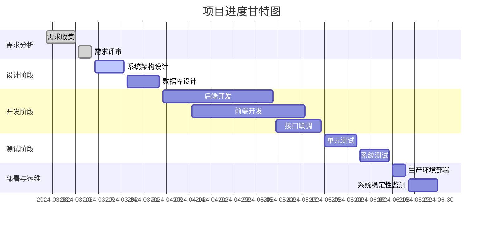

# MakersHub_Front-end
用于存放协会小程序前端的库 
#### 版本命名规则及近期开发安排
v0.1 实现基本框架、宣传信息可见，实现宣传部工作台。
v0.2 实现借物等基管功能可用（以及开门这个重要功能），实现基管工作台。
v0.3 实现项目立项等项目相关功能、积分兑换等可用，实现项目工作台和运维工作台可用。
v1.0 实现除社区外所有功能可用。

```mermaid
gantt
    title 项目进度甘特图
    dateFormat  YYYY-MM-DD
    section 需求分析
        需求收集            :done,    des1, 2024-03-01, 2024-03-10
        需求评审            :done,    des2, 2024-03-11, 2024-03-15
    section 设计阶段
        系统架构设计        :active,  des3, 2024-03-16, 2024-03-25
        数据库设计          :         des4, 2024-03-26, 2024-04-05
    section 开发阶段
        后端开发            :         des5, 2024-04-06, 2024-05-10
        前端开发            :         des6, 2024-04-15, 2024-05-20
        接口联调            :         des7, 2024-05-11, 2024-05-25
    section 测试阶段
        单元测试            :         des8, 2024-05-26, 2024-06-05
        系统测试            :         des9, 2024-06-06, 2024-06-15
    section 部署与运维
        生产环境部署        :         des10, 2024-06-16, 2024-06-20
        系统稳定性监测      :         des11, 2024-06-21, 2024-06-30

```

