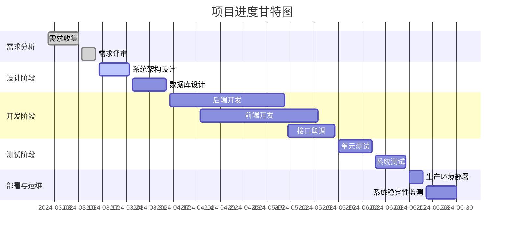

# MakersHub_Front-end

用于存放协会小程序前端的库

#### 版本命名规则及近期开发安排

v0.1 实现基本框架、宣传信息可见，实现宣传部工作台。
v0.2 实现借物等基管功能可用（以及开门这个重要功能），实现基管工作台。
v0.3 实现项目立项等项目相关功能、积分兑换等可用，实现项目工作台和运维工作台可用。
v1.0 实现除社区外所有功能可用。



```
MakersHub_Front-end
├─ 📁abandoned
│  ├─ 📁login
│  │  ├─ 📄login.js
│  │  ├─ 📄login.json
│  │  ├─ 📄login.wxml
│  │  └─ 📄login.wxss
│  └─ 📁register
│     ├─ 📄register.js
│     ├─ 📄register.json
│     ├─ 📄register.wxml
│     └─ 📄register.wxss
├─ 📁components
│  ├─ 📁auth-modal
│  │  ├─ 📄auth-modal.js
│  │  └─ 📄auth-modal.wxml
│  └─ 📁navBar
│     ├─ 📄app.js
│     ├─ 📄navBar.js
│     ├─ 📄navBar.json
│     ├─ 📄navBar.wxml
│     └─ 📄navBar.wxss
├─ 📁images
│  ├─ 📁3D
│  │  ├─ 📄upload-one.svg
│  │  └─ 📄white_cat.svg
│  ├─ 📁activity
│  │  ├─ 📄door_icon.svg
│  │  ├─ 📄upload.svg
│  │  └─ 📄white_cat.svg
│  ├─ 📁activitydetail
│  │  ├─ 📄api.jpg
│  │  ├─ 📄cat_background.png
│  │  ├─ 📄cat_black.svg
│  │  └─ 📄copy.svg
│  ├─ 📁activity_list
│  │  ├─ 📄mock_poster1.jpg
│  │  ├─ 📄mock_poster2.jpg
│  │  ├─ 📄mock_poster3.jpg
│  │  ├─ 📄mock_poster4.jpg
│  │  ├─ 📄mock_poster5.jpg
│  │  └─ 📄white_cat.svg
│  ├─ 📁base_management_work_page
│  │  ├─ 📄1.svg
│  │  ├─ 📄2.svg
│  │  ├─ 📄3.svg
│  │  ├─ 📄4.svg
│  │  ├─ 📄icon_arrow_chevron-right_black.svg
│  │  └─ 📄icon_arrow_chevron-right_white.svg
│  ├─ 📁club_work
│  │  ├─ 📄applyDuty.svg
│  │  ├─ 📄cat_head.svg
│  │  ├─ 📄circuit_split.svg
│  │  ├─ 📄clean.svg
│  │  ├─ 📄department_img.png
│  │  ├─ 📄onDuty.svg
│  │  └─ 📄remote.svg
│  ├─ 📁duty_application
│  │  └─ 📄white_cat.svg
│  ├─ 📁editPage
│  │  ├─ 📄avatar.png
│  │  ├─ 📄cat_in_bottom.svg
│  │  ├─ 📄edit picture.svg
│  │  ├─ 📄me.svg
│  │  ├─ 📄stylegreen.svg
│  │  └─ 📄telephone.svg
│  ├─ 📁index
│  │  ├─ 📄activity.svg
│  │  ├─ 📄area.svg
│  │  ├─ 📄background.png
│  │  ├─ 📄borrow.svg
│  │  ├─ 📄cat_background.svg
│  │  ├─ 📄cat_black.svg
│  │  ├─ 📄cat_white.svg
│  │  ├─ 📄community_unchosen.svg
│  │  ├─ 📄contest.svg
│  │  ├─ 📄message.svg
│  │  ├─ 📄me_chosen.svg
│  │  ├─ 📄me_unchosen.svg
│  │  ├─ 📄notice.svg
│  │  ├─ 📄program_check.svg
│  │  └─ 📄program_establish.svg
│  ├─ 📁login
│  │  ├─ 📄login_cat.png
│  │  ├─ 📄login_dial.png
│  │  ├─ 📄preview-close.svg
│  │  └─ 📄preview-open.svg
│  ├─ 📁me
│  │  ├─ 📄avatar.png
│  │  ├─ 📄cat_background.svg
│  │  ├─ 📄cat_black.svg
│  │  ├─ 📄cat_white.svg
│  │  ├─ 📄community_unchosen.svg
│  │  ├─ 📄copy.svg
│  │  ├─ 📄edit.svg
│  │  ├─ 📄me_chosen.svg
│  │  ├─ 📄me_unchosen.svg
│  │  ├─ 📄phone.svg
│  │  ├─ 📄right_arrow_black.svg
│  │  ├─ 📄right_arrow_white.svg
│  │  ├─ 📄separate.svg
│  │  └─ 📄style.svg
│  ├─ 📁my_points
│  │  ├─ 📄3d_print.png
│  │  └─ 📄white_cat.svg
│  ├─ 📁object_borrow_list
│  │  ├─ 📄1.png
│  │  └─ 📄white_cat.svg
│  ├─ 📁operation_maintenance_work_page
│  │  ├─ 📄1.svg
│  │  ├─ 📄2.svg
│  │  ├─ 📄3.svg
│  │  ├─ 📄icon_arrow_chevron-right_black.svg
│  │  └─ 📄icon_arrow_chevron-right_white.svg
│  ├─ 📁project_work_page
│  │  ├─ 📄1.svg
│  │  ├─ 📄2.svg
│  │  ├─ 📄3.svg
│  │  ├─ 📄icon_arrow_chevron-right_black.svg
│  │  └─ 📄icon_arrow_chevron-right_white.svg
│  ├─ 📁pubulicity_work_page
│  │  ├─ 📄1.svg
│  │  ├─ 📄2.svg
│  │  ├─ 📄3.svg
│  │  ├─ 📄4.svg
│  │  ├─ 📄cat.svg
│  │  ├─ 📄icon_arrow_chevron-right_black.svg
│  │  └─ 📄icon_arrow_chevron-right_white.svg
│  ├─ 📁register
│  │  ├─ 📄preview-close.svg
│  │  ├─ 📄preview-open.svg
│  │  └─ 📄register_dial.png
│  ├─ 📁remote_control
│  │  ├─ 📄push_door.svg
│  │  └─ 📄white_cat.svg
│  ├─ 📁schedule
│  │  ├─ 📄edit.svg
│  │  └─ 📄white_cat.svg
│  └─ 📁site_borrow_list
│     ├─ 📄1.png
│     └─ 📄white_cat.svg
├─ 📁pages
│  ├─ 📁3D                          #3D打印申请
│  │  ├─ 📄3D.js
│  │  ├─ 📄3D.json
│  │  ├─ 📄3D.wxml
│  │  └─ 📄3D.wxss
│  ├─ 📁activitydetail              # 活动详情查看
│  │  ├─ 📄activitydetail.js
│  │  ├─ 📄activitydetail.json
│  │  ├─ 📄activitydetail.wxml
│  │  └─ 📄activitydetail.wxss
│  ├─ 📁activity_list               # 活动列表查看
│  │  ├─ 📄activity_list.js
│  │  ├─ 📄activity_list.json
│  │  ├─ 📄activity_list.wxml
│  │  └─ 📄activity_list.wxss
│  ├─ 📁activity_submit             # 活动宣传发布
│  │  ├─ 📄activity_submit.js
│  │  ├─ 📄activity_submit.json
│  │  ├─ 📄activity_submit.wxml
│  │  └─ 📄activity_submit.wxss
│  ├─ 📁base_management_work_page   # 基管部工作入口
│  │  ├─ 📄base_management_work_page.js
│  │  ├─ 📄base_management_work_page.json
│  │  ├─ 📄base_management_work_page.wxml
│  │  └─ 📄base_management_work_page.wxss
│  ├─ 📁club_work                   # 协会各部门工作入口
│  │  ├─ 📄club_work.js
│  │  ├─ 📄club_work.json
│  │  ├─ 📄club_work.wxml
│  │  └─ 📄club_work.wxss
│  ├─ 📁duty_application            # 值班申请
│  │  ├─ 📄duty_application.js
│  │  ├─ 📄duty_application.json
│  │  ├─ 📄duty_application.wxml
│  │  └─ 📄duty_application.wxss
│  ├─ 📁duty_arrange                # 值班安排
│  │  ├─ 📄duty_arrange.js
│  │  ├─ 📄duty_arrange.json
│  │  ├─ 📄duty_arrange.wxml
│  │  └─ 📄duty_arrange.wxss
│  ├─ 📁editPage                    # 个人信息修改
│  │  ├─ 📄editPage.js
│  │  ├─ 📄editPage.json
│  │  ├─ 📄editPage.wxml
│  │  └─ 📄editPage.wxss
│  ├─ 📁index                       # 首页
│  │  ├─ 📄index.js
│  │  ├─ 📄index.json
│  │  ├─ 📄index.wxml
│  │  └─ 📄index.wxss
│  ├─ 📁me                          # 我的
│  │  ├─ 📄me.js
│  │  ├─ 📄me.json
│  │  ├─ 📄me.wxml
│  │  └─ 📄me.wxss
│  ├─ 📁MyPoints                    # 我的积分
│  │  ├─ 📄MyPoints.js
│  │  ├─ 📄MyPoints.json
│  │  ├─ 📄MyPoints.wxml
│  │  └─ 📄MyPoints.wxss
│  ├─ 📁my_site_borrow_detail       # 我的场地借用详情
│  │  ├─ 📄my_site_borrow_detail.js
│  │  ├─ 📄my_site_borrow_detail.json
│  │  ├─ 📄my_site_borrow_detail.wxml
│  │  └─ 📄my_site_borrow_detail.wxss
│  ├─ 📁my_site_borrow_list         # 我的场地借用列表
│  │  ├─ 📄my_site_borrow_list.js
│  │  ├─ 📄my_site_borrow_list.json
│  │  ├─ 📄my_site_borrow_list.wxml
│  │  └─ 📄my_site_borrow_list.wxss
│  ├─ 📁my_stuff_borrow_detail      # 我的借物申请详情（同时可处理个人和团队）
│  │  ├─ 📄my_stuff_borrow_detail.js
│  │  ├─ 📄my_stuff_borrow_detail.json
│  │  ├─ 📄my_stuff_borrow_detail.wxml
│  │  └─ 📄my_stuff_borrow_detail.wxss
│  ├─ 📁my_stuff_borrow_list        # 我的借物列表
│  │  ├─ 📄my_stuff_borrow_list.js
│  │  ├─ 📄my_stuff_borrow_list.json
│  │  ├─ 📄my_stuff_borrow_list.wxml
│  │  └─ 📄my_stuff_borrow_list.wxss
│  ├─ 📁stuff_borrow_permit_list            # 借物申请审核列表
│  │  ├─ 📄stuff_borrow_permit_list.js
│  │  ├─ 📄stuff_borrow_permit_list.json
│  │  ├─ 📄stuff_borrow_permit_list.wxml
│  │  └─ 📄stuff_borrow_permit_list.wxss
│  ├─ 📁operation_maintenance_work_page     # 运维部工作入口
│  │  ├─ 📄operation_maintenance_work_page.js
│  │  ├─ 📄operation_maintenance_work_page.json
│  │  ├─ 📄operation_maintenance_work_page.wxml
│  │  └─ 📄operation_maintenance_work_page.wxss
│  ├─ 📁personal_stuff_borrow_apply         # 个人借物申请
│  │  ├─ 📄personal_stuff_borrow_apply.js
│  │  ├─ 📄personal_stuff_borrow_apply.json
│  │  ├─ 📄personal_stuff_borrow_apply.wxml
│  │  └─ 📄personal_stuff_borrow_apply.wxss
│  ├─ 📁personal_stuff_borrow_permit        # 个人借物审核
│  │  ├─ 📄personal_stuff_borrow_permit.js
│  │  ├─ 📄personal_stuff_borrow_permit.json
│  │  ├─ 📄personal_stuff_borrow_permit.wxml
│  │  └─ 📄personal_stuff_borrow_permit.wxss
│  ├─ 📁project_work_page                   # 项目部工作入口
│  │  ├─ 📄project_work_page.js
│  │  ├─ 📄project_work_page.json
│  │  ├─ 📄project_work_page.wxml
│  │  └─ 📄project_work_page.wxss
│  ├─ 📁publicity_work_page                 # 宣传部工作入口
│  │  ├─ 📄publicity_work_page.js
│  │  ├─ 📄publicity_work_page.json
│  │  ├─ 📄publicity_work_page.wxml
│  │  └─ 📄publicity_work_page.wxss
│  ├─ 📁remote_control                      # 远程控制
│  │  ├─ 📄remote_control.js
│  │  ├─ 📄remote_control.json
│  │  ├─ 📄remote_control.wxml
│  │  └─ 📄remote_control.wxss
│  ├─ 📁schedule                            # 宣传部学年工作安排
│  │  ├─ 📄schedule.js
│  │  ├─ 📄schedule.json
│  │  ├─ 📄schedule.wxml
│  │  └─ 📄schedule.wxss
│  ├─ 📁site_borrow_apply                   # 场地借用申请
│  │  ├─ 📄site_borrow_apply.js
│  │  ├─ 📄site_borrow_apply.json
│  │  ├─ 📄site_borrow_apply.wxml
│  │  └─ 📄site_borrow_apply.wxss
│  ├─ 📁site_borrow_list
│  │  ├─ 📄site_borrow_list.js
│  │  ├─ 📄site_borrow_list.json
│  │  ├─ 📄site_borrow_list.wxml
│  │  └─ 📄site_borrow_list.wxss
│  ├─ 📁site_borrow_permit                  # 场地借用审核
│  │  ├─ 📄site_borrow_permit.js
│  │  ├─ 📄site_borrow_permit.json
│  │  ├─ 📄site_borrow_permit.wxml
│  │  └─ 📄site_borrow_permit.wxss
│  ├─ 📁task                                # 任务发布
│  │  ├─ 📄task.js
│  │  ├─ 📄task.json
│  │  ├─ 📄task.wxml
│  │  └─ 📄task.wxss
│  ├─ 📁team_stuff_borrow_apply             # 团队借物申请
│  │  ├─ 📄team_stuff_borrow_apply.js
│  │  ├─ 📄team_stuff_borrow_apply.json
│  │  ├─ 📄team_stuff_borrow_apply.wxml
│  │  └─ 📄team_stuff_borrow_apply.wxss
│  ├─ 📁team_stuff_borrow_permit            # 团队借物审核
│  │  ├─ 📄team_stuff_borrow_permit.js
│  │  ├─ 📄team_stuff_borrow_permit.json
│  │  ├─ 📄team_stuff_borrow_permit.wxml
│  │  └─ 📄team_stuff_borrow_permit.wxss
│  └─ 📁xiumi                               # 秀米链接提交
│     ├─ 📄xiumi.js
│     ├─ 📄xiumi.json
│     ├─ 📄xiumi.wxml
│     └─ 📄xiumi.wxss
├─ 📁utils
│  ├─ 📄2025-06-09_16-55-00-0.png
│  ├─ 📄page.js
│  ├─ 📄promisify.js
│  └─ 📄util.js
├─ 📄app.js
├─ 📄app.json
├─ 📄app.wxss
├─ 📄config.js
├─ 📄project.config.json
├─ 📄project.private.config.json
├─ 📄README.md
└─ 📄sitemap.json
```
